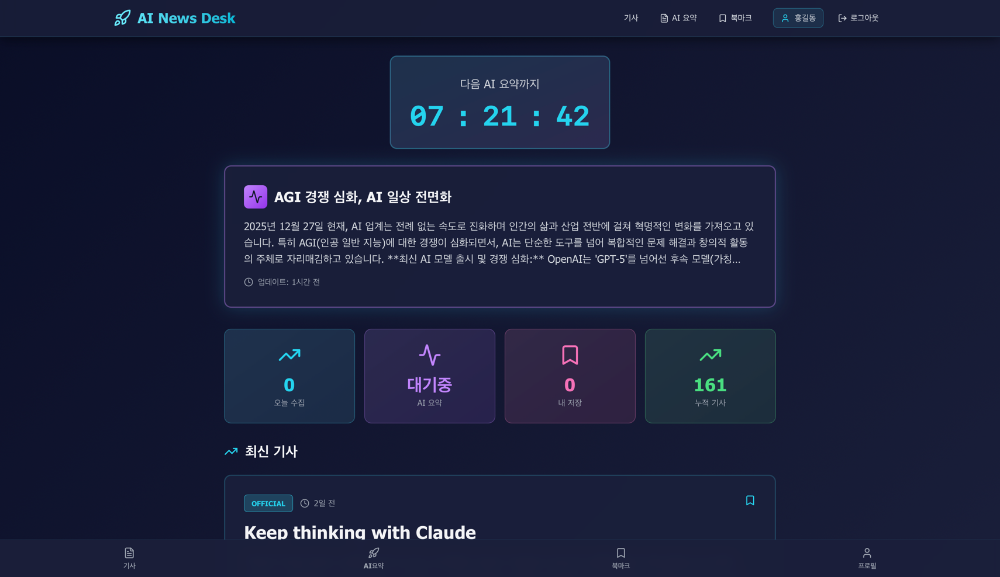
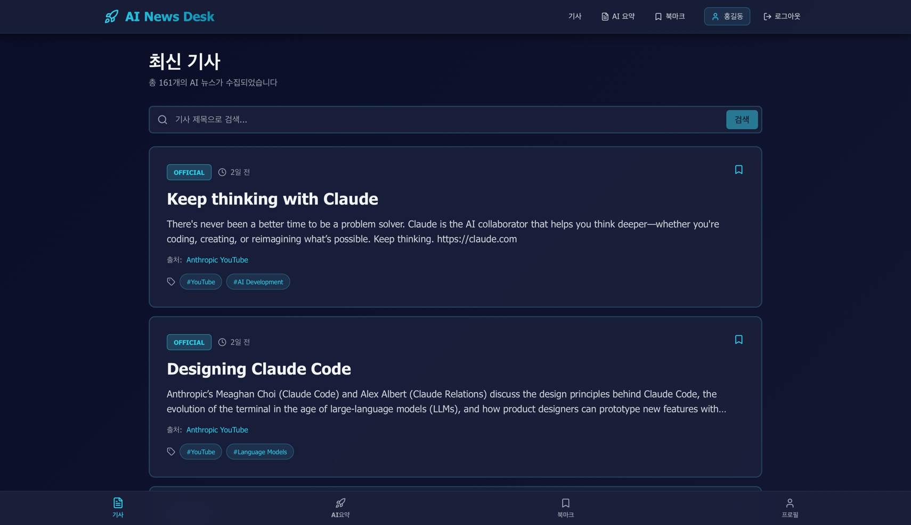
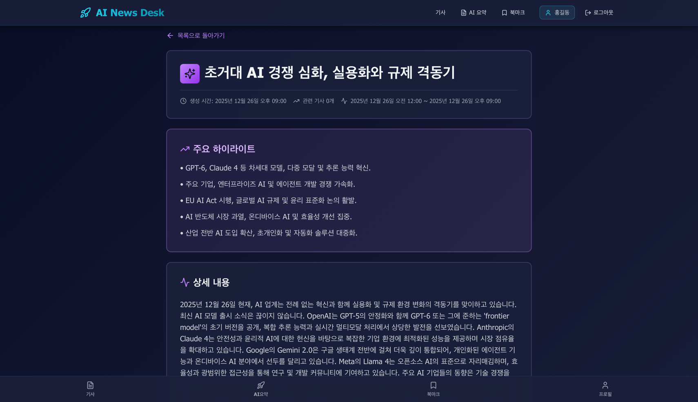
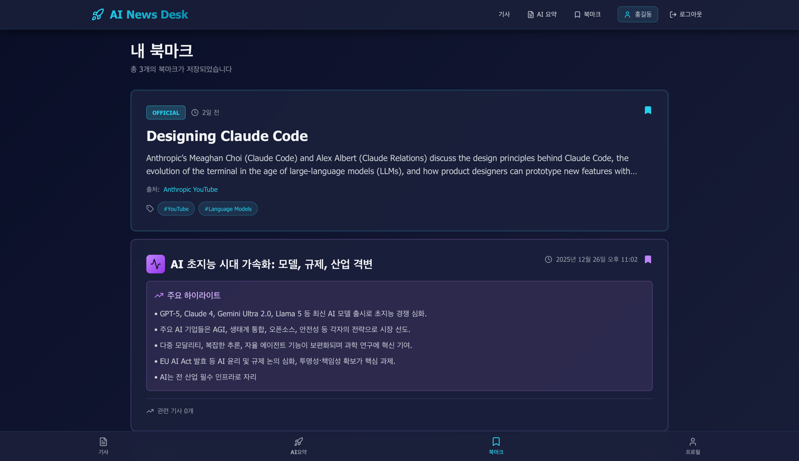
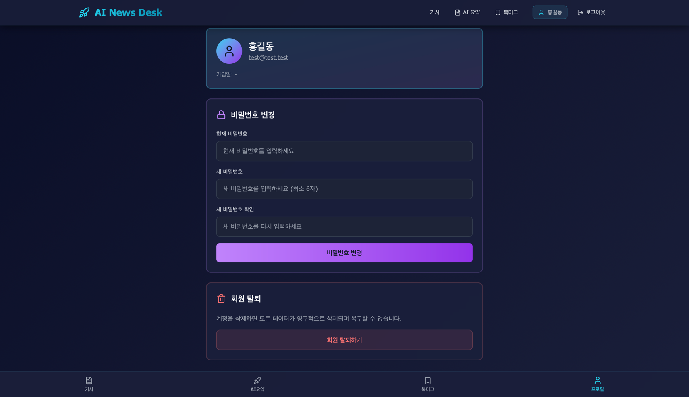

# 🚀 AI News Desk

[](LICENSE)
[](https://www.oracle.com/java/)
[](https://spring.io/projects/spring-boot)
[](https://react.dev/)
[](https://nodejs.org/)

AI 기술 뉴스 자동 수집 및 요약 서비스

## 📊 주요 기능

- **자동 뉴스 크롤링** - YouTube API를 활용한 OpenAI, Google DeepMind, Anthropic 공식 채널 자동 수집
- **AI 요약 생성** - Google Gemini 2.5 Flash로 뉴스 핵심 내용 자동 요약 및 분석
- **실시간 모니터링** - 스케줄러 기반 자동 크롤링 (매일 00시, 12시) 및 AI 요약 (매시 정각)
- **사용자 맞춤 기능** - JWT 인증, 북마크, 검색, 카테고리별 필터링
- **반응형 UI** - 다크 모드 기반 모던 디자인, 모바일/데스크톱 완벽 지원

## 🏗️ 기술 스택

### Backend
- **Spring Boot 3.2.1** - REST API 서버
- **Spring Security + JWT** - 토큰 기반 인증
- **Spring Data JPA** - ORM 데이터 접근
- **MySQL** - 관계형 데이터베이스
- **Google Gemini API** - AI 요약 생성
- **YouTube Data API v3** - 동영상 메타데이터 수집
- **Maven** - 빌드 도구

### Frontend
- **React 18** - UI 라이브러리
- **Vite** - 빌드 도구
- **Tailwind CSS** - 유틸리티 우선 CSS 프레임워크
- **React Router** - 클라이언트 사이드 라우팅
- **Axios** - HTTP 클라이언트
- **react-hot-toast** - 알림 메시지

## 📂 프로젝트 구조

```
ai-news-desk/
├── backend/
│   ├── src/main/java/com/ainewsdesk/
│   │   ├── config/           # 보안, Swagger, API 설정
│   │   ├── controller/       # REST API 컨트롤러
│   │   ├── service/          # 비즈니스 로직
│   │   ├── repository/       # JPA 리포지토리
│   │   ├── entity/           # JPA 엔티티
│   │   ├── dto/              # 데이터 전송 객체
│   │   ├── security/         # JWT, 인증 필터
│   │   ├── crawler/          # YouTube 크롤러
│   │   ├── scheduler/        # 자동 스케줄링
│   │   ├── mapper/           # 엔티티-DTO 변환
│   │   ├── filter/           # HTTP 로깅 필터
│   │   └── exception/        # 예외 처리
│   └── src/main/resources/
│       └── application.properties.example
├── frontend/
│   ├── src/
│   │   ├── components/       # 재사용 컴포넌트
│   │   ├── pages/            # 페이지 컴포넌트
│   │   ├── services/         # API 통신
│   │   ├── context/          # React Context
│   │   └── utils/            # 유틸리티 함수
│   ├── package.json
│   └── vite.config.js
└── README.md
```

## 🚀 시작하기

### 필수 요구사항

- **Java 17** 이상
- **Node.js 18** 이상
- **MySQL 8.0** 이상
- **YouTube Data API Key**
- **Google Gemini API Key**

### 설치 및 실행

#### 1. 저장소 클론

```bash
git clone https://github.com/jsha2217/ai-news-desk.git
cd ai-news-desk
```

#### 2. 데이터베이스 생성

```sql
CREATE DATABASE ai_news_desk CHARACTER SET utf8mb4 COLLATE utf8mb4_unicode_ci;
```

#### 3. Backend 설정

```bash
cd backend
```

`src/main/resources/application.properties` 파일 생성 (`.example` 참고):

```properties
# Database
spring.datasource.url=jdbc:mysql://localhost:3306/ai_news_desk?useSSL=false&serverTimezone=UTC
spring.datasource.username=your-username
spring.datasource.password=your-password

# JWT
spring.jwt.secret=your-jwt-secret-key-at-least-32-characters-long
spring.jwt.expiration=86400000

# YouTube API
youtube.api.key=your-youtube-api-key

# Gemini API
gemini.api.key=your-gemini-api-key
```

#### 4. Backend 실행

```bash
# Maven을 사용하여 실행
./mvnw spring-boot:run

# 또는 JAR 빌드 후 실행
./mvnw clean package
java -jar target/ai-news-desk-0.0.1-SNAPSHOT.jar
```

Backend 서버: `http://localhost:8080/api`

#### 5. Frontend 설정 및 실행

새 터미널에서:

```bash
cd frontend
npm install
npm run dev
```

Frontend 서버: `http://localhost:3000`

## 📸 주요 화면

### 메인 페이지
최신 AI 뉴스를 한눈에 확인하고 북마크 저장



---

### 기사 목록
카테고리별, 출처별 필터링 및 검색 기능



---

### AI 요약
Gemini API로 생성된 주요 뉴스 요약 및 핵심 하이라이트



---

### 북마크
저장한 기사와 AI 요약을 한 곳에서 관리



---

### 프로필
계정 정보 관리 및 비밀번호 변경



---

## 📡 API 문서

[📚 View Swagger UI](https://petstore.swagger.io/?url=https://cdn.jsdelivr.net/gh/jsha2217/ai-news-desk@main/backend/docs/openapi.json) | [📄 View Custom Docs](https://cdn.jsdelivr.net/gh/jsha2217/ai-news-desk@main/backend/docs/index.html)

### 인증 (Authentication)

| Method | Endpoint | Description |
|--------|----------|-------------|
| POST | `/api/auth/register` | 회원가입 |
| POST | `/api/auth/login` | 로그인 |
| GET | `/api/auth/me` | 현재 사용자 정보 |
| PUT | `/api/auth/password` | 비밀번호 변경 |
| DELETE | `/api/auth/account` | 계정 삭제 |

### 기사 (Articles)

| Method | Endpoint | Description |
|--------|----------|-------------|
| GET | `/api/articles` | 기사 목록 조회 (페이징) |
| GET | `/api/articles/{id}` | 기사 상세 조회 |
| GET | `/api/articles/search` | 기사 검색 (?keyword=) |
| GET | `/api/articles/source/{sourceType}` | 출처별 조회 |

### AI 요약 (AI Summaries)

| Method | Endpoint | Description |
|--------|----------|-------------|
| GET | `/api/ai-summaries` | AI 요약 목록 조회 (페이징) |
| GET | `/api/ai-summaries/{id}` | AI 요약 상세 조회 |
| POST | `/api/ai-summaries/generate` | AI 요약 수동 생성 |

### 북마크 (Bookmarks)

| Method | Endpoint | Description |
|--------|----------|-------------|
| GET | `/api/bookmarks` | 내 북마크 목록 |
| POST | `/api/bookmarks` | 북마크 추가 |
| DELETE | `/api/bookmarks` | 북마크 제거 |
| GET | `/api/bookmarks/check` | 북마크 상태 확인 |
| GET | `/api/bookmarks/check/batch` | 북마크 일괄 확인 |

**Swagger UI**: `http://localhost:8080/api/swagger-ui/index.html`

## 🔧 개발

### 코드 스타일
- Backend: Google Java Style Guide
- Frontend: Airbnb JavaScript Style Guide
- Commit Convention: Conventional Commits

### 주요 라이브러리 버전
- Spring Boot: 3.2.1
- Spring Security: 6.2.0
- jjwt: 0.12.3
- MySQL Connector: 8.0.33
- React: 18.2.0
- React Router: 6.20.1
- Axios: 1.6.2
- Tailwind CSS: 3.3.6

## 🚢 배포

### Backend
- **AWS EC2** 또는 **Railway/Render**
- JAR 파일 빌드: `./mvnw clean package`
- 환경변수로 민감 정보 관리

### Frontend
- **Vercel** 또는 **Netlify**
- Build 명령: `npm run build`
- Output 디렉토리: `dist/`

### 데이터베이스
- **AWS RDS MySQL** 또는 **PlanetScale**

## 📝 라이센스

이 프로젝트는 MIT 라이센스 하에 배포됩니다. 자세한 내용은 [LICENSE](LICENSE) 파일을 참조하세요.

## 👨‍💻 개발자

**jsha2217**

- GitHub: [@jsha2217](https://github.com/jsha2217)

## 💬 문의

프로젝트에 대한 질문이나 제안사항이 있으시면 [Issues](https://github.com/jsha2217/ai-news-desk/issues)를 통해 연락해주세요.

---

⭐ 이 프로젝트가 도움이 되셨다면 스타를 눌러주세요!
